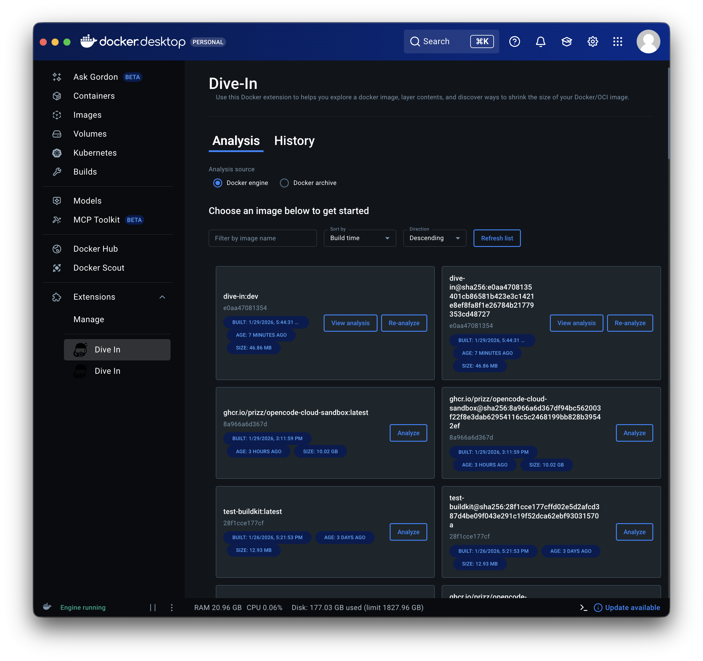
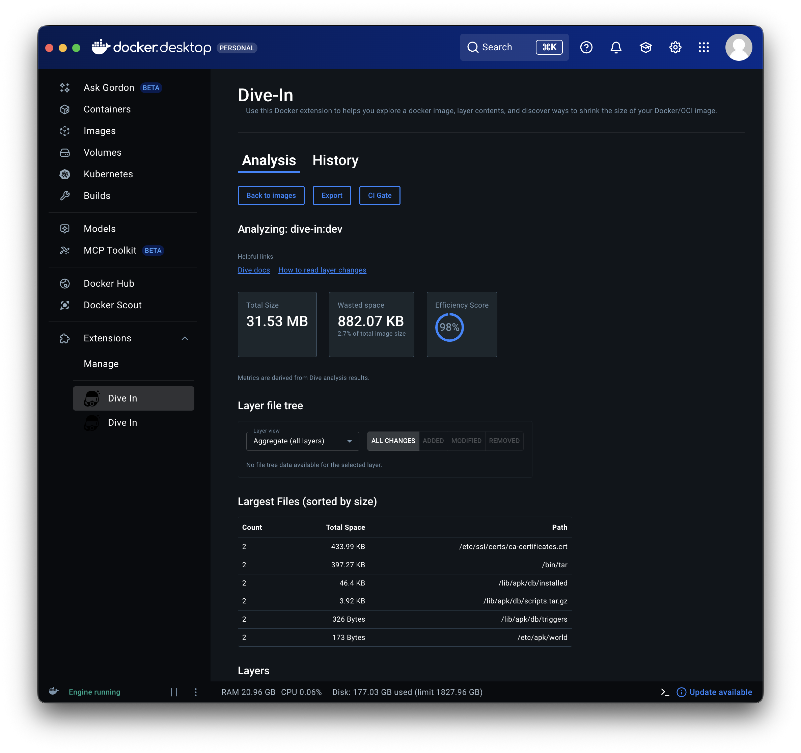
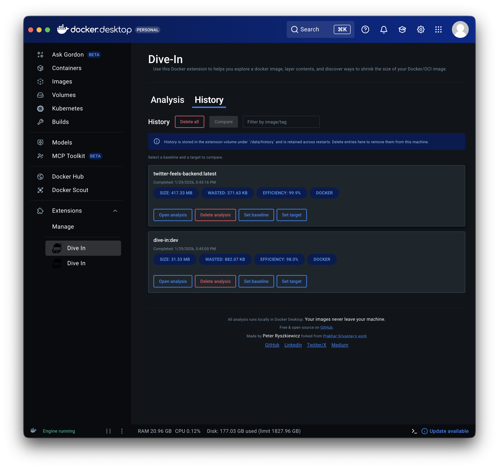

# Deep Dive

[](https://github.com/pRizz/deep-dive)
[](https://github.com/pRizz/deep-dive/actions/workflows/ci.yml)
[](https://github.com/pRizz/deep-dive/releases)
[](https://hub.docker.com/r/prizz/deep-dive)
[](https://hub.docker.com/r/prizz/deep-dive)
[](https://hub.docker.com/r/prizz/deep-dive)
[](https://github.com/pRizz/deep-dive/blob/main/LICENSE)

A Docker extension that helps you explore a docker image, layer contents, and discover ways to shrink the size of your Docker/OCI image.

Quick Install: Docker Extension
```bash
docker extension install prizz/deep-dive:latest
```

Quick Install: Codex Skills for Dockerfile Enhancements/Fixes (Global)
```bash
curl -fsSL "https://raw.githubusercontent.com/pRizz/deep-dive/main/.codex/skills/install-all.sh" | bash
```

Built on top of the Dive CLI: [pRizz/dive](https://github.com/pRizz/dive), a fork of the excellent [wagoodman/dive](https://github.com/wagoodman/dive) CLI tool.

Based on the original extension by Prakhar Srivastav:
https://github.com/prakhar1989/dive-in

## Highlights

- Analysis and History are split into dedicated tabs.
- Prompts tab includes copy-ready AI Dockerfile optimization templates and skill exports.
- Image list includes filtering, sorting, refresh, and metadata chips.
- History supports compare, export, and delete actions.
- CI gate rules can be generated for `.dive-ci`.

Prompts and skills usage guide (including Codex install paths such as `~/.codex/skills` and project-local `.codex/skills`): `docs/prompts-and-skills.md`
Repo-local generated Codex skills are written to `.codex/skills` via `just build-skills` (also run by `just build`, `just check`, and `just dev`).
Direct raw-link install guidance and the generated skills index live at `.codex/skills/README.md`.
Official Codex skills docs: [overview](https://developers.openai.com/codex/skills), [create](https://developers.openai.com/codex/skills#create-a-skill), [install](https://developers.openai.com/codex/skills#install-skills)





## Installation

Make sure your Docker desktop supports extensions. This extension can be installed
from [Docker Hub](https://hub.docker.com/extensions/prizz/deep-dive) or in
Docker Desktop.

Publishing guide: see `PUBLISHING.md`.

## Support the project

If Deep Dive is useful, you can [Like it on Docker Hub](https://hub.docker.com/extensions/prizz/deep-dive), [star it on GitHub](https://github.com/pRizz/deep-dive), and share written feedback in [GitHub Issues](https://github.com/pRizz/deep-dive/issues).

## Development

Go through [the official docs](https://docs.docker.com/desktop/extensions-sdk/quickstart/) to understand the basic setting up of the Docker extension.

### Prerequisites

- **Docker Desktop 4.10.0+** (extensions must be enabled)
- **Bun 1.3.8** (matches packageManager and engines)
- **Go 1.19+** (matches vm/go.mod)
- **Note:** Dive CLI is bundled in the extension VM and not required locally

### Fast dev loop (primary workflow)

For rapid UI iteration with hot-reload:

1. Start the UI dev server: `just ui-dev` (runs Vite on http://localhost:5173)
2. In another terminal, connect Docker Desktop to the dev server:
   ```bash
   docker extension dev ui-source deep-dive:dev http://localhost:5173
   ```
3. Optional: Enable debug mode:
   ```bash
   docker extension dev debug deep-dive:dev
   ```

This workflow allows hot-reload of UI changes without rebuilding the extension image.

### Initial setup

1. Install project dependencies: `just install`
2. Build and install the local extension: `just install-development-extension`
   - This builds the image as `deep-dive:dev` and installs it in Docker Desktop

### Recommended local checks

- Run the full local gate before opening a PR: `just check`
- Auto-format JS/TS files with Biome: `just fix`

### Updating local extension

After making code changes, rebuild and update:

- **Recommended:** `just reinstall-development-extension`
- **Manual:** `just docker-build` then `docker extension update deep-dive:dev --force`

### Troubleshooting

- **Extension appears stale:** Run `just reinstall-development-extension` to clear caches
- **Docker-archive analyses:** Use full absolute paths (Docker Desktop requirement)
- **UI changes don't appear:** Ensure the dev server is running (`just ui-dev`) and `docker extension dev ui-source` is active
